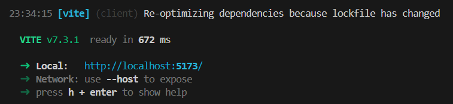
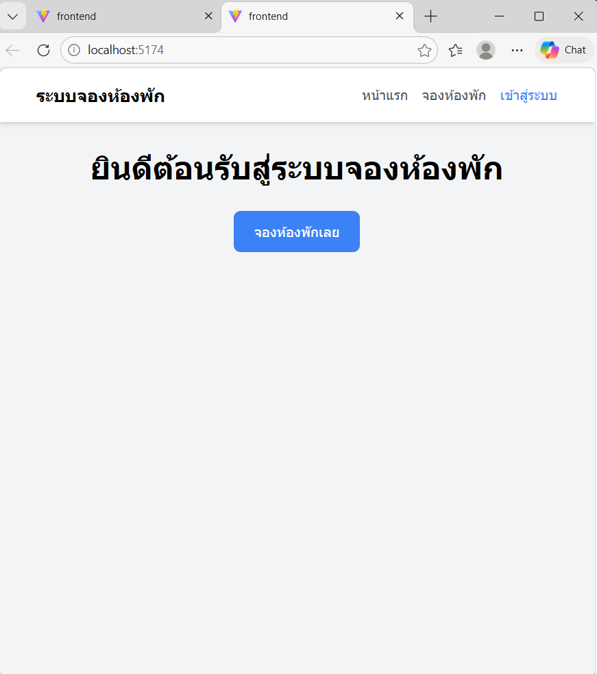
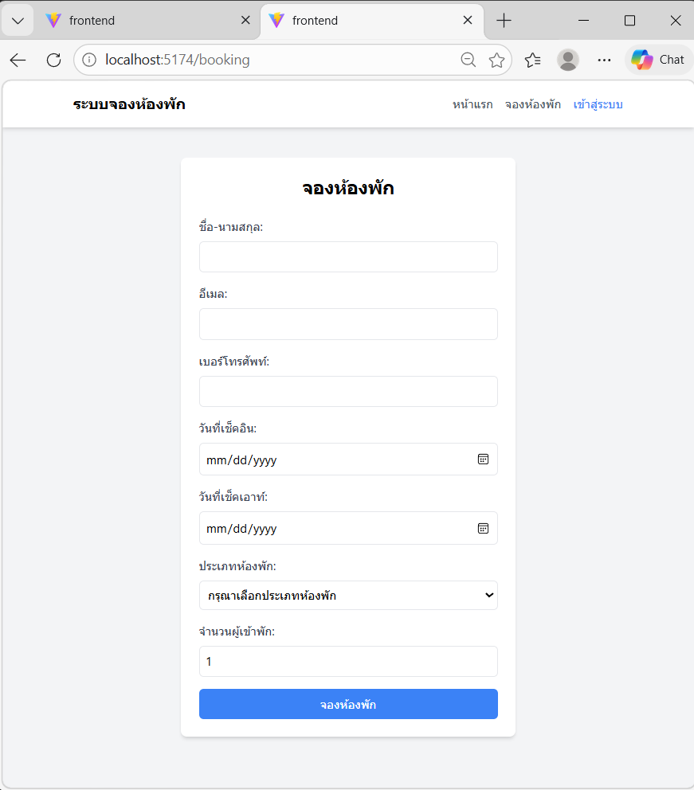

# ใบงานปฏิบัติการ: การพัฒนาระบบจองห้องพักออนไลน์
### Full-Stack Hotel Booking System with Authentication

> **วิชา:** การออกแบบและพัฒนาซอฟต์แวร์ (Software Design and Development)  
> **เทคโนโลยี:** Node.js · Express · React · SQLite · JWT · Tailwind CSS · Postman

---

## วัตถุประสงค์
**นักศึกษาสามารถ**
1. อธิบายหลักการพัฒนา Full-Stack Web Application ได้
2. ออกแบบและจัดการฐานข้อมูลด้วย SQLite ได้
3. สร้าง REST API ด้วย Node.js และ Express Framework ได้
4. สร้าง Frontend ด้วย React และ Tailwind CSS ได้
5. พัฒนาระบบ Authentication ด้วย JWT (JSON Web Token) ได้


---

## ทฤษฎีที่เกี่ยวข้อง — Backend

### 1. REST API และ HTTP Methods

REST (Representational State Transfer) คือสถาปัตยกรรมการออกแบบ API ที่ใช้หลักการ HTTP Protocol

| HTTP Method | การใช้งาน | ตัวอย่าง Endpoint |
|:-----------:|-----------|-------------------|
| `GET` | ดึงข้อมูล (Read) | `GET /api/bookings` |
| `POST` | สร้างข้อมูลใหม่ (Create) | `POST /api/bookings` |
| `PUT` | แก้ไขข้อมูลทั้งหมด (Update) | `PUT /api/bookings/:id` |
| `PATCH` | แก้ไขข้อมูลบางส่วน (Partial Update) | `PATCH /api/bookings/:id` |
| `DELETE` | ลบข้อมูล (Delete) | `DELETE /api/bookings/:id` |

**HTTP Status Codes ที่สำคัญ**

| Code | ความหมาย |
|------|----------|
| `200 OK` | สำเร็จ |
| `201 Created` | สร้างข้อมูลสำเร็จ |
| `400 Bad Request` | คำขอไม่ถูกต้อง |
| `401 Unauthorized` | ยังไม่ได้ Login |
| `403 Forbidden` | ไม่มีสิทธิ์เข้าถึง |
| `404 Not Found` | ไม่พบข้อมูล |
| `500 Internal Server Error` | เซิร์ฟเวอร์ผิดพลาด |

---

### 2. JWT Authentication

JWT (JSON Web Token) เป็นมาตรฐานสำหรับการส่งข้อมูลระหว่าง parties ในรูปแบบ JSON ที่มีการเซ็นชื่อ (signature) ทำให้ตรวจสอบความถูกต้องได้

```
Header.Payload.Signature
```

- **Header:** อัลกอริทึมที่ใช้เข้ารหัส เช่น `HS256`
- **Payload:** ข้อมูลที่ต้องการส่ง เช่น `id`, `username`, `role`
- **Signature:** ลายเซ็นดิจิทัลเพื่อตรวจสอบความถูกต้อง

> ⚠️ **ความปลอดภัย:** JWT token มีอายุจำกัด (ในใบงานนี้กำหนด 1 ชั่วโมง) หากหมดอายุต้อง Login ใหม่เพื่อรับ token ใหม่

---

### 3. Express.js — เวอร์ชันและ Built-in Middleware

#### Express 4.16+ — `express.json()` แทน `body-parser`

ตั้งแต่ **Express 4.16.0** (ปี 2017) เป็นต้นมา Express มี built-in middleware สำหรับอ่าน JSON request body แล้ว จึงไม่จำเป็นต้องติดตั้ง `body-parser` แยกต่างหากอีกต่อไป

```javascript
// ❌ เดิม — ต้องติดตั้ง body-parser แยก
const bodyParser = require('body-parser');
app.use(bodyParser.json());

// ✅ ใหม่ — ใช้ express.json() ที่มีอยู่แล้วใน Express 4.16+
app.use(express.json());
```

> 💡 `body-parser` ยังใช้งานได้และ Express ใช้มันภายในอยู่เช่นกัน แต่ไม่จำเป็นต้องประกาศเองอีกแล้ว

#### Express 5 — Stable Release

Express 5 เผยแพร่เป็น stable release ในเดือนตุลาคม 2024 มีการเปลี่ยนแปลงสำคัญคือ **route handlers รองรับ `async/await` โดยตรง** โดย Express จะจัดการ error จาก Promise ที่ reject ให้อัตโนมัติ

```javascript
// Express 4 — ต้องใช้ try/catch เองในทุก async route
app.get('/api/bookings', authenticateToken, async (req, res) => {
  try {
    const rows = await db.allAsync('SELECT * FROM bookings ORDER BY created_at DESC');
    res.json(rows);
  } catch (err) {
    res.status(500).json({ error: err.message }); // ต้องจัดการเอง
  }
});

// Express 5 — ไม่ต้อง try/catch, Express รับ error ที่เกิดจาก async ให้เอง
app.get('/api/bookings', authenticateToken, async (req, res) => {
  const rows = await db.allAsync('SELECT * FROM bookings ORDER BY created_at DESC');
  res.json(rows);
  // ถ้า db.allAsync() throw error → Express ส่งไปยัง error handler อัตโนมัติ
});
```

> 📌 **หมายเหตุ:** ใบงานนี้ใช้ **Express 4** ซึ่งยังเป็น LTS และใช้งานได้ปกติ การที่รู้จัก Express 5 ช่วยให้เข้าใจทิศทางการพัฒนาของ Node.js ecosystem

| | Express 4 | Express 5 |
|--|-----------|-----------|
| ติดตั้ง | `npm install express` | `npm install express@5` |
| async route error | ต้องจัดการด้วย try/catch | Express จัดการอัตโนมัติ |
| body-parser built-in | ✅ (4.16+) | ✅ |
| Node.js รองรับ | v0.10+ | v18+ |

---

### 4. การออกแบบฐานข้อมูล

ระบบใช้ **2 ตาราง** ใน SQLite

**ตาราง `users` — สำหรับระบบ Login**

| Column | Type | Constraint | คำอธิบาย |
|--------|------|-----------|----------|
| `id` | INTEGER | PRIMARY KEY AUTOINCREMENT | รหัสผู้ใช้ |
| `username` | TEXT | UNIQUE NOT NULL | ชื่อผู้ใช้งาน |
| `password` | TEXT | NOT NULL | รหัสผ่านที่ผ่านการ Hash แล้ว |
| `role` | TEXT | NOT NULL DEFAULT 'user' | สิทธิ์: `admin` หรือ `user` |
| `created_at` | TIMESTAMP | DEFAULT CURRENT_TIMESTAMP | วันที่สร้างบัญชี |

**ตาราง `bookings` — สำหรับข้อมูลการจอง**

| Column | Type | คำอธิบาย |
|--------|------|----------|
| `id` | INTEGER | รหัสการจอง |
| `fullname` | TEXT | ชื่อผู้จอง |
| `email` | TEXT | อีเมล |
| `phone` | TEXT | เบอร์โทรศัพท์ |
| `checkin` | DATE | วันที่เช็คอิน |
| `checkout` | DATE | วันที่เช็คเอาท์ |
| `roomtype` | TEXT | ประเภทห้อง |
| `guests` | INTEGER | จำนวนผู้เข้าพัก |
| `status` | TEXT | สถานะการจอง (default: `pending`) |
| `comment` | TEXT | หมายเหตุ |
| `created_at` | TIMESTAMP | วันที่สร้าง |

> 🔐 **ความปลอดภัยของรหัสผ่าน:** ต้องไม่เก็บ password เป็น plain text เสมอใช้ `bcrypt.hashSync('password', 10)` ก่อนบันทึก

---

## การทดลองที่ 1: การสร้างโครงสร้างโปรเจคและ Backend API

### 1.1 การเตรียมสภาพแวดล้อม

#### ตรวจสอบการติดตั้ง Node.js

```bash
node --version    # ควรเห็น v22.x.x หรือสูงกว่า
npm --version     # ควรเห็น 10.x.x หรือสูงกว่า
```

> 💡 หากยังไม่ได้ติดตั้ง Node.js ดาวน์โหลดได้ที่ https://nodejs.org เลือกเวอร์ชัน **LTS**

#### สร้างโครงสร้างโปรเจค

```bash
mkdir hotel-booking-system
cd hotel-booking-system
mkdir backend frontend
```

#### ตั้งค่าโปรเจค Backend

```bash
cd backend
npm init -y
npm install express sqlite3 cors jsonwebtoken bcryptjs
npm install --save-dev nodemon
```

> 💡 **ไม่ต้องติดตั้ง `body-parser`** — Express 4.16+ มี `express.json()` ในตัวแล้ว

เพิ่ม scripts ในไฟล์ `package.json`

```json
{
  "scripts": {
    "start": "node server.js",
    "dev": "nodemon server.js"
  }
}
```

> 📌 ไฟล์ `package.json` ที่สมบูรณ์จะมี dependencies เพียง `express`, `sqlite3`, `cors`, `jsonwebtoken`, `bcryptjs` — ไม่มี `body-parser`

---

### 1.2 การสร้างฐานข้อมูล (`database.js`)

สร้างไฟล์ `database.js` ในโฟลเดอร์ `backend`

```javascript
const sqlite3 = require('sqlite3').verbose();
const bcrypt = require('bcryptjs');

const db = new sqlite3.Database('bookings.db', (err) => {
  if (err) {
    console.error('เกิดข้อผิดพลาดในการเชื่อมต่อฐานข้อมูล:', err);
  } else {
    console.log('เชื่อมต่อฐานข้อมูลสำเร็จ');
    createTables();
  }
});

const createTables = () => {
  // ตาราง users สำหรับระบบ Login
  db.run(`
    CREATE TABLE IF NOT EXISTS users (
      id       INTEGER   PRIMARY KEY AUTOINCREMENT,
      username TEXT      UNIQUE NOT NULL,
      password TEXT      NOT NULL,
      role     TEXT      NOT NULL DEFAULT 'user',
      created_at TIMESTAMP DEFAULT CURRENT_TIMESTAMP
    )
  `);

  // ตาราง bookings สำหรับข้อมูลการจอง
  db.run(`
    CREATE TABLE IF NOT EXISTS bookings (
      id         INTEGER   PRIMARY KEY AUTOINCREMENT,
      fullname   TEXT      NOT NULL,
      email      TEXT      NOT NULL,
      phone      TEXT      NOT NULL,
      checkin    DATE      NOT NULL,
      checkout   DATE      NOT NULL,
      roomtype   TEXT      NOT NULL,
      guests     INTEGER   NOT NULL,
      status     TEXT      DEFAULT 'pending',
      comment    TEXT,
      created_at TIMESTAMP DEFAULT CURRENT_TIMESTAMP
    )
  `);

  // สร้าง admin account เริ่มต้น (INSERT OR IGNORE = ข้ามถ้ามีอยู่แล้ว)
  const adminPassword = bcrypt.hashSync('admin123', 10);
  db.run(
    `INSERT OR IGNORE INTO users (username, password, role) VALUES (?, ?, ?)`,
    ['admin', adminPassword, 'admin']
  );
};

module.exports = db;
```

> 📌 `INSERT OR IGNORE` จะข้ามการ INSERT หากมี username ซ้ำ ทำให้ไม่เกิด error เมื่อรันโปรแกรมครั้งถัดไป

---

### 1.3 การสร้าง REST API Server (`server.js`)

สร้างไฟล์ `server.js` ในโฟลเดอร์ `backend`

#### 1.3.1 Setup และ Middleware

```javascript
const express    = require('express');
const cors       = require('cors');
const jwt        = require('jsonwebtoken');
const bcrypt     = require('bcryptjs');
const db         = require('./database');

const app        = express();
const PORT       = 3001;
const JWT_SECRET = process.env.JWT_SECRET || 'your-secret-key';

app.use(cors());
app.use(express.json()); // Express 4.16+ — ไม่ต้องใช้ body-parser อีกต่อไป

// Middleware: ตรวจสอบ JWT Token ก่อนเข้าถึง protected routes
const authenticateToken = (req, res, next) => {
  const authHeader = req.headers['authorization'];
  const token = authHeader && authHeader.split(' ')[1]; // "Bearer TOKEN"

  if (!token) {
    return res.status(401).json({ error: 'กรุณาเข้าสู่ระบบก่อน' });
  }

  jwt.verify(token, JWT_SECRET, (err, user) => {
    if (err) {
      return res.status(403).json({ error: 'Token ไม่ถูกต้องหรือหมดอายุ' });
    }
    req.user = user;
    next();
  });
};
```

#### 1.3.2 Login Endpoint

```javascript
// POST /api/login — ตรวจสอบ username/password และออก JWT
app.post('/api/login', (req, res) => {
  const { username, password } = req.body;

  if (!username || !password) {
    return res.status(400).json({ error: 'กรุณากรอก username และ password' });
  }

  db.get('SELECT * FROM users WHERE username = ?', [username], async (err, user) => {
    if (err)   return res.status(500).json({ error: err.message });
    if (!user) return res.status(401).json({ error: 'ชื่อผู้ใช้หรือรหัสผ่านไม่ถูกต้อง' });

    const validPassword = await bcrypt.compare(password, user.password);
    if (!validPassword) {
      return res.status(401).json({ error: 'ชื่อผู้ใช้หรือรหัสผ่านไม่ถูกต้อง' });
    }

    const token = jwt.sign(
      { id: user.id, username: user.username, role: user.role },
      JWT_SECRET,
      { expiresIn: '1h' }
    );

    res.json({
      token,
      user: { id: user.id, username: user.username, role: user.role }
    });
  });
});
```

#### 1.3.3 Booking Endpoints

```javascript
// POST /api/bookings — สร้างการจองใหม่ (ไม่ต้อง login)
app.post('/api/bookings', (req, res) => {
  const { fullname, email, phone, checkin, checkout, roomtype, guests } = req.body;
  const sql = `INSERT INTO bookings (fullname, email, phone, checkin, checkout, roomtype, guests)
               VALUES (?, ?, ?, ?, ?, ?, ?)`;

  db.run(sql, [fullname, email, phone, checkin, checkout, roomtype, guests], function(err) {
    if (err) return res.status(400).json({ error: err.message });
    db.get('SELECT * FROM bookings WHERE id = ?', [this.lastID], (err, row) => {
      if (err) return res.status(400).json({ error: err.message });
      res.status(201).json(row);
    });
  });
});

// GET /api/bookings — ดึงข้อมูลทั้งหมด (ต้อง login)
app.get('/api/bookings', authenticateToken, (req, res) => {
  db.all('SELECT * FROM bookings ORDER BY created_at DESC', [], (err, rows) => {
    if (err) return res.status(400).json({ error: err.message });
    res.json(rows);
  });
});

// GET /api/bookings/:id — ดึงข้อมูลตาม ID (ต้อง login)
app.get('/api/bookings/:id', authenticateToken, (req, res) => {
  db.get('SELECT * FROM bookings WHERE id = ?', [req.params.id], (err, row) => {
    if (err)  return res.status(400).json({ error: err.message });
    if (!row) return res.status(404).json({ error: 'ไม่พบข้อมูลการจอง' });
    res.json(row);
  });
});

// PUT /api/bookings/:id — อัปเดตการจอง (ต้อง login)
app.put('/api/bookings/:id', authenticateToken, (req, res) => {
  const { fullname, email, phone, checkin, checkout, roomtype, guests, comment } = req.body;
  const sql = `UPDATE bookings
               SET fullname=?, email=?, phone=?, checkin=?, checkout=?,
                   roomtype=?, guests=?, comment=?
               WHERE id=?`;

  db.run(sql, [fullname, email, phone, checkin, checkout, roomtype, guests, comment, req.params.id],
    function(err) {
      if (err)             return res.status(400).json({ error: err.message });
      if (this.changes === 0) return res.status(404).json({ error: 'ไม่พบข้อมูลการจอง' });

      db.get('SELECT * FROM bookings WHERE id = ?', [req.params.id], (err, row) => {
        if (err) return res.status(400).json({ error: err.message });
        res.json(row);
      });
    }
  );
});

// DELETE /api/bookings/:id — ลบการจอง (ต้อง login)
app.delete('/api/bookings/:id', authenticateToken, (req, res) => {
  db.run('DELETE FROM bookings WHERE id = ?', [req.params.id], function(err) {
    if (err)             return res.status(400).json({ error: err.message });
    if (this.changes === 0) return res.status(404).json({ error: 'ไม่พบข้อมูลการจอง' });
    res.json({ message: 'ลบข้อมูลสำเร็จ', id: req.params.id });
  });
});

app.listen(PORT, () => console.log(`Server running on port ${PORT}`));
```

#### 1.3.4 การรัน Backend Server

```bash
npm run dev
```

ผลลัพธ์ที่ควรเห็น:

```
[nodemon] starting `node server.js`
เชื่อมต่อฐานข้อมูลสำเร็จ
Server running on port 3001
```

### 📸 บันทึกผลการทดลอง: ผลการรัน Backend Server

> แทรกรูปภาพที่นี่

---

## การทดลองที่ 2: การทดสอบ API ด้วย Postman

### 2.1 การตั้งค่า Postman

1. ดาวน์โหลดและติดตั้ง Postman จาก https://www.postman.com/downloads/
2. ไปที่ **Environments → Globals** แล้วเพิ่ม Variables ดังนี้

| Variable | Initial Value | คำอธิบาย |
|----------|--------------|----------|
| `baseUrl` | `http://localhost:3001` | URL ของ Backend Server |
| `token` | *(เว้นว่าง)* | JWT Token (จะกรอกหลัง Login) |

> 💡 การใช้ `{{baseUrl}}` และ `{{token}}` ทำให้ไม่ต้องพิมพ์ซ้ำในทุก request

---

### 2.2 การทดสอบ Login

สร้าง Request ใหม่ใน Postman

| ฟิลด์ | ค่า |
|-------|-----|
| Method | `POST` |
| URL | `{{baseUrl}}/api/login` |
| Body (raw JSON) | `{ "username": "admin", "password": "admin123" }` |

กด **Send** — ควรได้รับ Status `200 OK` พร้อม token

```json
{
  "token": "eyJhbGciOiJIUzI1NiIsInR5cCI6IkpXVCJ9...",
  "user": {
    "id": 1,
    "username": "admin",
    "role": "admin"
  }
}
```

**คัดลอก token** ไปวางใน Globals Variable ชื่อ `token` (ทั้ง Initial value และ Current value) แล้วกด **Save**

### 📸 บันทึกผลการทดลอง: ผลการทดสอบ Login และ Token

> แทรกรูปภาพที่นี่

---

### 2.3 การทดสอบ CRUD Operations

#### 2.3.1 สร้างการจองใหม่ (POST)

> ไม่ต้องใช้ Token

```
Method : POST
URL    : {{baseUrl}}/api/bookings
Headers: Content-Type: application/json
```

```json
{
  "fullname": "[ชื่อ-นามสกุลนักศึกษา]",
  "email": "student@example.com",
  "phone": "0812345678",
  "checkin": "2025-03-01",
  "checkout": "2025-03-03",
  "roomtype": "standard",
  "guests": 2
}
```

**ทำการเพิ่มข้อมูลอีก 2 รายการ** โดยเปลี่ยนแปลงข้อมูลในแต่ละครั้ง

### 📸 บันทึกผลการทดลอง: ผลการเพิ่มข้อมูลการจอง (POST) 3 รายการ

> แทรกรูปภาพที่นี่

---

#### 2.3.2 ดึงข้อมูลทั้งหมด (GET All)

> ต้องใช้ Token

```
Method : GET
URL    : {{baseUrl}}/api/bookings
Headers: Authorization: Bearer {{token}}
```

### 📸 บันทึกผลการทดลอง: ผลการ GET ข้อมูลทั้งหมด

> แทรกรูปภาพที่นี่

> ⚠️ หาก response แจ้ง `"Token ไม่ถูกต้องหรือหมดอายุ"` ให้ Login ใหม่แล้วอัปเดต token ใน Globals

---

#### 2.3.3 ดึงข้อมูลตาม ID (GET by ID)

```
Method : GET
URL    : {{baseUrl}}/api/bookings/1
Headers: Authorization: Bearer {{token}}
```

### 📸 บันทึกผลการทดลอง: ผลการ GET ข้อมูลโดยระบุ ID

> แทรกรูปภาพที่นี่

---

#### 2.3.4 แก้ไขข้อมูลการจอง (PUT)

```
Method : PUT
URL    : {{baseUrl}}/api/bookings/1
Headers: Authorization: Bearer {{token}}
         Content-Type: application/json
```

```json
{
  "fullname": "[ชื่อ-นามสกุลนักศึกษา] (Updated)",
  "email": "updated@example.com",
  "phone": "0898765432",
  "checkin": "2025-03-01",
  "checkout": "2025-03-04",
  "roomtype": "deluxe",
  "guests": 3,
  "comment": "Updated by [ชื่อนักศึกษา]"
}
```

### 📸 บันทึกผลการทดลอง: ผลการแก้ไขข้อมูล (PUT) — ต้องเห็น comment ที่ไม่เป็น null

> แทรกรูปภาพที่นี่

---

#### 2.3.5 ลบข้อมูลการจอง (DELETE)

```
Method : DELETE
URL    : {{baseUrl}}/api/bookings/1
Headers: Authorization: Bearer {{token}}
```

### 📸 บันทึกผลการทดลอง: ผลการลบข้อมูล (DELETE)

> แทรกรูปภาพที่นี่

---

### 🔧 งานปรับปรุงโค้ด

1. แก้ไข endpoint `DELETE` ให้ส่ง response เป็น JSON ที่มี `status: "ลบข้อมูลสำเร็จโดย [ชื่อนักศึกษา]"`
2. เพิ่ม endpoint `GET /api/users` (ต้อง `authenticateToken`) เพื่อดูรายการ user ทั้งหมด **โดยไม่แสดง password**

### 📸 บันทึกผลการทดลอง: ผลการ DELETE with custom status และ GET /api/users

> แทรกรูปภาพที่นี่

---

## การทดลองที่ 3: การพัฒนา Frontend ด้วย React

### ทฤษฎีที่เกี่ยวข้อง — React Hooks

| Hook | หน้าที่หลัก | ตัวอย่างการใช้งาน | เปรียบเสมือน |
|------|------------|------------------|--------------|
| `useState` | เก็บและจัดการข้อมูล | เก็บข้อมูลฟอร์ม, error, loading | สมุดบันทึก |
| `useEffect` | จัดการ side effects | ดึงข้อมูล API ตอน component mount | ระบบแจ้งเตือน |
| `useNavigate` | นำทางระหว่างหน้า | redirect หลัง login สำเร็จ | GPS นำทาง |
| `useContext` | แชร์ข้อมูลทั่วแอป | เก็บ user/token สำหรับ auth | ประกาศกระจายเสียง |

---

### 3.1 การตั้งค่าโปรเจค React

> เปิด Terminal ใหม่ (ไม่ปิด Terminal ที่รัน Backend)

```bash
cd ../frontend
npm create vite@latest . -- --template react
npm install
npm install axios react-router-dom
npm install -D tailwindcss@3 postcss autoprefixer
npx tailwindcss init -p
```

**แก้ไขไฟล์ `tailwind.config.js`**

```javascript
export default {
  content: ["./index.html", "./src/**/*.{js,ts,jsx,tsx}"],
  theme: { extend: {} },
  plugins: [],
};
```

**แก้ไขไฟล์ `src/index.css`** (ลบทุกอย่างแล้วใส่เฉพาะนี้)

```css
@tailwind base;
@tailwind components;
@tailwind utilities;
```

**สร้างโฟลเดอร์**

```bash
mkdir -p src/components src/contexts
```

---

**สร้างไฟล์ `.env`** ในโฟลเดอร์ `frontend/` เพื่อกำหนด URL ของ Backend

```bash
# frontend/.env
VITE_API_URL=http://localhost:3001
```

> 💡 การใช้ `.env` ทำให้เปลี่ยน port ได้ที่เดียวโดยไม่ต้องแก้ทุก component ถ้า backend รันที่ port อื่น เช่น 3002 ให้แก้แค่บรรทัดนี้บรรทัดเดียว

**สร้างไฟล์ `src/config.js`** เพื่อใช้ค่าจาก `.env` ทั่วทั้งแอป

```javascript
const API_URL = import.meta.env.VITE_API_URL || 'http://localhost:3001';

export default API_URL;
```

**เพิ่ม `.env` ใน `.gitignore`** เพื่อไม่ให้ push ขึ้น GitHub

```bash
# เปิดไฟล์ .gitignore แล้วเพิ่มบรรทัดนี้
.env
.env.local
```

แล้วสร้าง `.env.example` ไว้เป็นตัวอย่างสำหรับคนอื่นในทีม

```bash
# frontend/.env.example
VITE_API_URL=http://localhost:3001
```

> ⚠️ **ทุกครั้งที่แก้ไฟล์ `.env` ต้องรัน `npm run dev` ใหม่** เพราะ Vite โหลดค่า environment variable ตอนเริ่มต้นเท่านั้น

---

**ทดสอบรัน**

```bash
npm run dev
```

### 📸 บันทึกผลการทดลอง: ผลการรัน Frontend เริ่มต้น

> แทรกรูปภาพที่นี่

---

### 3.2 การสร้าง Components

#### 3.2.1 `AuthContext.jsx` — ระบบจัดการ Authentication

สร้างไฟล์ `src/contexts/AuthContext.jsx`

```jsx
import React, { createContext, useContext, useState, useEffect } from 'react';

const AuthContext = createContext(null);

export const AuthProvider = ({ children }) => {
  const [user, setUser]   = useState(null);
  const [token, setToken] = useState(null);
  const [loading, setLoading] = useState(true);

  useEffect(() => {
    // โหลดข้อมูล login จาก localStorage เมื่อเปิดแอปใหม่
    const savedToken = localStorage.getItem('token');
    const savedUser  = localStorage.getItem('user');
    if (savedToken && savedUser) {
      setToken(savedToken);
      setUser(JSON.parse(savedUser));
    }
    setLoading(false);
  }, []);

  const login = (userData, newToken) => {
    setUser(userData);
    setToken(newToken);
    localStorage.setItem('token', newToken);
    localStorage.setItem('user', JSON.stringify(userData));
  };

  const logout = () => {
    setUser(null);
    setToken(null);
    localStorage.removeItem('token');
    localStorage.removeItem('user');
  };

  return (
    <AuthContext.Provider value={{ user, token, login, logout, loading }}>
      {!loading && children}
    </AuthContext.Provider>
  );
};

export const useAuth = () => useContext(AuthContext);
```

> 💡 `localStorage` เก็บข้อมูลใน browser ทำให้ผู้ใช้ไม่ต้อง Login ใหม่ทุกครั้งที่ refresh หน้าเว็บ

---

#### 3.2.2 `Login.jsx` — หน้า Login

สร้างไฟล์ `src/components/Login.jsx`

```jsx
import React, { useState } from 'react';
import { useNavigate } from 'react-router-dom';
import axios from 'axios';
import { useAuth } from '../contexts/AuthContext';
import API_URL from '../config';

const Login = () => {
  const navigate = useNavigate();
  const { login } = useAuth();
  const [formData, setFormData] = useState({ username: '', password: '' });
  const [error, setError]     = useState('');
  const [loading, setLoading] = useState(false);

  const handleSubmit = async (e) => {
    e.preventDefault();
    setError('');
    setLoading(true);
    try {
      const response = await axios.post(`${API_URL}/api/login`, formData);
      login(response.data.user, response.data.token);
      navigate('/admin');
    } catch (err) {
      setError(err.response?.data?.error || 'เกิดข้อผิดพลาดในการเข้าสู่ระบบ');
    } finally {
      setLoading(false);
    }
  };

  return (
    <div className="min-h-screen bg-gray-100 flex items-center justify-center">
      <div className="max-w-md w-full bg-white rounded-lg shadow-md p-8">
        <h2 className="text-2xl font-bold text-center mb-6">เข้าสู่ระบบ</h2>

        {error && (
          <div className="bg-red-100 border border-red-400 text-red-700 px-4 py-3 rounded mb-4">
            {error}
          </div>
        )}

        <form onSubmit={handleSubmit} className="space-y-4">
          <div>
            <label className="block text-gray-700 mb-2">ชื่อผู้ใช้:</label>
            <input
              type="text"
              value={formData.username}
              onChange={(e) => setFormData({ ...formData, username: e.target.value })}
              className="w-full p-2 border rounded-md focus:ring-2 focus:ring-blue-500"
              required
            />
          </div>
          <div>
            <label className="block text-gray-700 mb-2">รหัสผ่าน:</label>
            <input
              type="password"
              value={formData.password}
              onChange={(e) => setFormData({ ...formData, password: e.target.value })}
              className="w-full p-2 border rounded-md focus:ring-2 focus:ring-blue-500"
              required
            />
          </div>
          <button
            type="submit"
            disabled={loading}
            className="w-full bg-blue-500 text-white py-2 px-4 rounded-md hover:bg-blue-600 disabled:opacity-50"
          >
            {loading ? 'กำลังเข้าสู่ระบบ...' : 'เข้าสู่ระบบ'}
          </button>
        </form>

        <p className="text-center text-gray-400 mt-4 text-sm">Default: admin / admin123</p>
      </div>
    </div>
  );
};

export default Login;
```

---

#### 3.2.3 `ProtectedRoute.jsx` — ป้องกันหน้าที่ต้องการ Login

สร้างไฟล์ `src/components/ProtectedRoute.jsx`

```jsx
import { Navigate } from 'react-router-dom';
import { useAuth } from '../contexts/AuthContext';

const ProtectedRoute = ({ children }) => {
  const { user, loading } = useAuth();
  if (loading) return <div className="text-center py-8">กำลังโหลด...</div>;
  if (!user)   return <Navigate to="/login" replace />;
  return children;
};

export default ProtectedRoute;
```

---

#### 3.2.4 `BookingForm.jsx` — หน้าจองห้องพัก (ผู้ใช้ทั่วไป)

สร้างไฟล์ `src/components/BookingForm.jsx`

```jsx
import React, { useState } from 'react';
import axios from 'axios';
import API_URL from '../config';

const BookingForm = () => {
  const [formData, setFormData] = useState({
    fullname: '', email: '', phone: '',
    checkin: '', checkout: '', roomtype: '', guests: 1,
  });
  const [error, setError]     = useState('');
  const [success, setSuccess] = useState('');

  const maxGuests = { standard: 2, deluxe: 3, suite: 4 };

  const handleChange = (e) => {
    const { name, value } = e.target;
    setFormData(prev => ({ ...prev, [name]: value }));
  };

  const handleSubmit = async (e) => {
    e.preventDefault();
    setError(''); setSuccess('');

    const checkin  = new Date(formData.checkin);
    const checkout = new Date(formData.checkout);
    const today    = new Date(); today.setHours(0, 0, 0, 0);

    if (checkin < today)        { setError('กรุณาเลือกวันเช็คอินที่ยังไม่ผ่านมา'); return; }
    if (checkout <= checkin)    { setError('วันเช็คเอาท์ต้องมาหลังวันเช็คอิน'); return; }
    if (!/^[0-9]{10}$/.test(formData.phone)) { setError('กรุณากรอกเบอร์โทรศัพท์ 10 หลัก'); return; }

    const days      = Math.ceil((checkout - checkin) / (1000 * 60 * 60 * 24));
    const roomNames = { standard: 'ห้องมาตรฐาน', deluxe: 'ห้องดีลักซ์', suite: 'ห้องสวีท' };
    const summary   =
      `สรุปการจอง:\n- ชื่อ: ${formData.fullname}\n` +
      `- ห้อง: ${roomNames[formData.roomtype]}\n` +
      `- จำนวนวัน: ${days} วัน\n- ผู้เข้าพัก: ${formData.guests} ท่าน`;

    if (window.confirm(summary + '\n\nยืนยันการจอง?')) {
      try {
        await axios.post(`${API_URL}/api/bookings`, formData);
        setSuccess('จองห้องพักเรียบร้อยแล้ว');
        setFormData({ fullname: '', email: '', phone: '', checkin: '', checkout: '', roomtype: '', guests: 1 });
      } catch (err) {
        setError(err.response?.data?.error || 'เกิดข้อผิดพลาด');
      }
    }
  };

  return (
    <div className="max-w-md mx-auto mt-10 p-6 bg-white rounded-lg shadow-md">
      <h2 className="text-2xl font-bold mb-6 text-center">จองห้องพัก</h2>

      {error   && <div className="bg-red-100   text-red-700   border border-red-400   px-4 py-3 rounded mb-4">{error}</div>}
      {success && <div className="bg-green-100 text-green-700 border border-green-400 px-4 py-3 rounded mb-4">{success}</div>}

      <form onSubmit={handleSubmit} className="space-y-4">
        {[
          { label: 'ชื่อ-นามสกุล:', name: 'fullname', type: 'text' },
          { label: 'อีเมล:',        name: 'email',    type: 'email' },
          { label: 'เบอร์โทรศัพท์:', name: 'phone',    type: 'tel' },
        ].map(({ label, name, type }) => (
          <div key={name}>
            <label className="block text-gray-700 mb-2">{label}</label>
            <input type={type} name={name} value={formData[name]} onChange={handleChange}
              className="w-full p-2 border rounded-md focus:ring-2 focus:ring-blue-500" required />
          </div>
        ))}

        <div>
          <label className="block text-gray-700 mb-2">วันที่เช็คอิน:</label>
          <input type="date" name="checkin" value={formData.checkin} onChange={handleChange}
            min={new Date().toISOString().split('T')[0]}
            className="w-full p-2 border rounded-md focus:ring-2 focus:ring-blue-500" required />
        </div>

        <div>
          <label className="block text-gray-700 mb-2">วันที่เช็คเอาท์:</label>
          <input type="date" name="checkout" value={formData.checkout} onChange={handleChange}
            min={formData.checkin}
            className="w-full p-2 border rounded-md focus:ring-2 focus:ring-blue-500" required />
        </div>

        <div>
          <label className="block text-gray-700 mb-2">ประเภทห้องพัก:</label>
          <select name="roomtype" value={formData.roomtype} onChange={handleChange}
            className="w-full p-2 border rounded-md focus:ring-2 focus:ring-blue-500" required>
            <option value="">กรุณาเลือกประเภทห้องพัก</option>
            <option value="standard">ห้องมาตรฐาน (สูงสุด 2 ท่าน)</option>
            <option value="deluxe">ห้องดีลักซ์ (สูงสุด 3 ท่าน)</option>
            <option value="suite">ห้องสวีท (สูงสุด 4 ท่าน)</option>
          </select>
        </div>

        <div>
          <label className="block text-gray-700 mb-2">จำนวนผู้เข้าพัก:</label>
          <input type="number" name="guests" value={formData.guests} onChange={handleChange}
            min="1" max={formData.roomtype ? maxGuests[formData.roomtype] : 1}
            className="w-full p-2 border rounded-md focus:ring-2 focus:ring-blue-500" required />
        </div>

        <button type="submit"
          className="w-full bg-blue-500 text-white py-2 px-4 rounded-md hover:bg-blue-600 transition-colors">
          จองห้องพัก
        </button>
      </form>
    </div>
  );
};

export default BookingForm;
```

---

#### 3.2.5 `BookingList.jsx` — รายการจองทั้งหมด (Admin)

สร้างไฟล์ `src/components/BookingList.jsx`

```jsx
import React, { useState, useEffect } from 'react';
import axios from 'axios';
import { Link } from 'react-router-dom';
import { useAuth } from '../contexts/AuthContext';
import API_URL from '../config';

const BookingList = () => {
  const [bookings, setBookings] = useState([]);
  const [loading, setLoading]   = useState(true);
  const [error, setError]       = useState(null);
  const { token, logout }       = useAuth();

  useEffect(() => { fetchBookings(); }, [token]);

  const fetchBookings = async () => {
    try {
      const response = await axios.get(`${API_URL}/api/bookings`, {
        headers: { Authorization: `Bearer ${token}` },
      });
      setBookings(response.data);
    } catch (err) {
      if (err.response?.status === 401 || err.response?.status === 403) {
        logout(); // Token หมดอายุ — ล็อกเอาท์อัตโนมัติ
      } else {
        setError('ไม่สามารถดึงข้อมูลได้: ' + err.message);
      }
    } finally {
      setLoading(false);
    }
  };

  const handleDelete = async (id) => {
    if (!window.confirm('ต้องการลบข้อมูลการจองนี้?')) return;
    try {
      await axios.delete(`${API_URL}/api/bookings/${id}`, {
        headers: { Authorization: `Bearer ${token}` },
      });
      fetchBookings();
    } catch (err) {
      alert('เกิดข้อผิดพลาดในการลบข้อมูล');
    }
  };

  if (loading) return <div className="text-center py-4">กำลังโหลดข้อมูล...</div>;
  if (error)   return <div className="text-center py-4 text-red-500">{error}</div>;

  const roomLabel = { standard: 'ห้องมาตรฐาน', deluxe: 'ห้องดีลักซ์', suite: 'ห้องสวีท' };

  return (
    <div className="container mx-auto px-4 py-8">
      <div className="flex justify-between items-center mb-6">
        <h2 className="text-2xl font-bold">รายการจองห้องพัก</h2>
        <Link to="/admin/bookings/new"
          className="bg-green-500 text-white px-4 py-2 rounded hover:bg-green-600">
          + เพิ่มการจอง
        </Link>
      </div>

      {bookings.length === 0 ? (
        <p className="text-center py-4 text-gray-500">ไม่พบข้อมูลการจอง</p>
      ) : (
        <div className="grid grid-cols-1 md:grid-cols-2 lg:grid-cols-3 gap-4">
          {bookings.map((booking) => (
            <div key={booking.id} className="bg-white p-4 rounded-lg shadow">
              <div className="flex justify-between items-start mb-2">
                <h3 className="font-bold">{booking.fullname}</h3>
                <div className="space-x-2">
                  <Link to={`/admin/bookings/edit/${booking.id}`}
                    className="text-blue-500 hover:text-blue-700 text-sm">แก้ไข</Link>
                  <button onClick={() => handleDelete(booking.id)}
                    className="text-red-500 hover:text-red-700 text-sm">ลบ</button>
                </div>
              </div>
              <p className="text-gray-600 text-sm">อีเมล: {booking.email}</p>
              <p className="text-gray-600 text-sm">เบอร์โทร: {booking.phone}</p>
              <p className="text-gray-600 text-sm">ประเภทห้อง: {roomLabel[booking.roomtype]}</p>
              <p className="text-gray-600 text-sm">
                เช็คอิน: {new Date(booking.checkin).toLocaleDateString('th-TH')}
              </p>
              <p className="text-gray-600 text-sm">
                เช็คเอาท์: {new Date(booking.checkout).toLocaleDateString('th-TH')}
              </p>
              <p className="text-gray-600 text-sm">ผู้เข้าพัก: {booking.guests} ท่าน</p>
              {booking.comment && (
                <p className="text-gray-500 text-sm mt-1 italic">หมายเหตุ: {booking.comment}</p>
              )}
            </div>
          ))}
        </div>
      )}
    </div>
  );
};

export default BookingList;
```

---

#### 3.2.6 `BookingEdit.jsx` — แก้ไขข้อมูลการจอง

สร้างไฟล์ `src/components/BookingEdit.jsx`

```jsx
import React, { useState, useEffect } from 'react';
import { useParams, useNavigate } from 'react-router-dom';
import axios from 'axios';
import { useAuth } from '../contexts/AuthContext';
import API_URL from '../config';

const BookingEdit = () => {
  const { id }         = useParams();
  const navigate       = useNavigate();
  const { token }      = useAuth();
  const [loading, setLoading] = useState(true);
  const [formData, setFormData] = useState({
    fullname: '', email: '', phone: '',
    checkin: '', checkout: '', roomtype: '', guests: 1, comment: '',
  });

  const maxGuests = { standard: 2, deluxe: 3, suite: 4 };

  useEffect(() => { fetchBooking(); }, [id]);

  const fetchBooking = async () => {
    try {
      const response = await axios.get(`${API_URL}/api/bookings/${id}`, {
        headers: { Authorization: `Bearer ${token}` },
      });
      const booking = response.data;
      booking.checkin  = booking.checkin.split('T')[0];
      booking.checkout = booking.checkout.split('T')[0];
      setFormData(booking);
      setLoading(false);
    } catch (err) {
      alert('ไม่สามารถดึงข้อมูลการจอง');
      navigate('/admin/bookings');
    }
  };

  const handleChange = (e) => {
    const { name, value } = e.target;
    setFormData(prev => ({ ...prev, [name]: value }));
  };

  const handleSubmit = async (e) => {
    e.preventDefault();
    try {
      await axios.put(`${API_URL}/api/bookings/${id}`, formData, {
        headers: { Authorization: `Bearer ${token}` },
      });
      alert('แก้ไขข้อมูลสำเร็จ');
      navigate('/admin/bookings');
    } catch (err) {
      alert(err.response?.data?.error || 'เกิดข้อผิดพลาด');
    }
  };

  if (loading) return <div className="text-center py-4">กำลังโหลด...</div>;

  return (
    <div className="max-w-md mx-auto mt-10 p-6 bg-white rounded-lg shadow-md">
      <h2 className="text-2xl font-bold mb-6 text-center">แก้ไขข้อมูลการจอง</h2>
      <form onSubmit={handleSubmit} className="space-y-4">

        {/* ---- ข้อมูลผู้จอง ---- */}
        {[
          { label: 'ชื่อ-นามสกุล:', name: 'fullname', type: 'text' },
          { label: 'อีเมล:',        name: 'email',    type: 'email' },
          { label: 'เบอร์โทรศัพท์:', name: 'phone',    type: 'tel' },
        ].map(({ label, name, type }) => (
          <div key={name}>
            <label className="block text-gray-700 mb-2">{label}</label>
            <input type={type} name={name} value={formData[name]} onChange={handleChange}
              className="w-full p-2 border rounded-md focus:ring-2 focus:ring-blue-500" required />
          </div>
        ))}

        {/* ---- วันที่ ---- */}
        <div>
          <label className="block text-gray-700 mb-2">วันที่เช็คอิน:</label>
          <input type="date" name="checkin" value={formData.checkin} onChange={handleChange}
            className="w-full p-2 border rounded-md focus:ring-2 focus:ring-blue-500" required />
        </div>
        <div>
          <label className="block text-gray-700 mb-2">วันที่เช็คเอาท์:</label>
          <input type="date" name="checkout" value={formData.checkout} onChange={handleChange}
            min={formData.checkin}
            className="w-full p-2 border rounded-md focus:ring-2 focus:ring-blue-500" required />
        </div>

        {/* ---- ประเภทห้อง ---- */}
        <div>
          <label className="block text-gray-700 mb-2">ประเภทห้องพัก:</label>
          <select name="roomtype" value={formData.roomtype} onChange={handleChange}
            className="w-full p-2 border rounded-md focus:ring-2 focus:ring-blue-500" required>
            <option value="standard">ห้องมาตรฐาน (สูงสุด 2 ท่าน)</option>
            <option value="deluxe">ห้องดีลักซ์ (สูงสุด 3 ท่าน)</option>
            <option value="suite">ห้องสวีท (สูงสุด 4 ท่าน)</option>
          </select>
        </div>

        {/* ---- จำนวนผู้เข้าพัก ---- */}
        <div>
          <label className="block text-gray-700 mb-2">จำนวนผู้เข้าพัก:</label>
          <input type="number" name="guests" value={formData.guests} onChange={handleChange}
            min="1" max={formData.roomtype ? maxGuests[formData.roomtype] : 4}
            className="w-full p-2 border rounded-md focus:ring-2 focus:ring-blue-500" required />
        </div>

        {/* ---- หมายเหตุ ---- */}
        <div>
          <label className="block text-gray-700 mb-2">หมายเหตุ:</label>
          <input type="text" name="comment" value={formData.comment || ''} onChange={handleChange}
            className="w-full p-2 border rounded-md focus:ring-2 focus:ring-blue-500" />
        </div>

        <div className="flex space-x-4">
          <button type="submit"
            className="flex-1 bg-blue-500 text-white py-2 px-4 rounded-md hover:bg-blue-600">
            บันทึก
          </button>
          <button type="button" onClick={() => navigate('/admin/bookings')}
            className="flex-1 bg-gray-500 text-white py-2 px-4 rounded-md hover:bg-gray-600">
            ยกเลิก
          </button>
        </div>
      </form>
    </div>
  );
};

export default BookingEdit;
```

---

#### 3.2.7 `AdminDashboard.jsx` — หน้าหลัก Admin

สร้างไฟล์ `src/components/AdminDashboard.jsx`

```jsx
import React from 'react';
import { Link, useNavigate } from 'react-router-dom';
import { useAuth } from '../contexts/AuthContext';

const AdminDashboard = () => {
  const { user, logout } = useAuth();
  const navigate = useNavigate();

  const handleLogout = () => {
    logout();
    navigate('/login');
  };

  return (
    <div className="container mx-auto px-4 py-8">
      <div className="flex justify-between items-center mb-8">
        <h1 className="text-3xl font-bold">ระบบจัดการห้องพัก</h1>
        <div className="flex items-center space-x-4">
          <span className="text-gray-600">ยินดีต้อนรับ: <strong>{user?.username}</strong></span>
          <button onClick={handleLogout}
            className="bg-red-500 text-white px-4 py-2 rounded hover:bg-red-600">
            ออกจากระบบ
          </button>
        </div>
      </div>

      <div className="grid grid-cols-1 md:grid-cols-3 gap-6">
        <Link to="/admin/bookings"
          className="bg-white p-6 rounded-lg shadow-md hover:shadow-lg transition-shadow">
          <h2 className="text-xl font-bold mb-2">📋 จัดการการจอง</h2>
          <p className="text-gray-600">ดู แก้ไข และลบข้อมูลการจอง</p>
        </Link>
        <Link to="/admin/rooms"
          className="bg-white p-6 rounded-lg shadow-md hover:shadow-lg transition-shadow">
          <h2 className="text-xl font-bold mb-2">🏨 จัดการห้องพัก</h2>
          <p className="text-gray-600">จัดการข้อมูลห้องพักและประเภทห้อง</p>
        </Link>
        <Link to="/admin/reports"
          className="bg-white p-6 rounded-lg shadow-md hover:shadow-lg transition-shadow">
          <h2 className="text-xl font-bold mb-2">📊 รายงาน</h2>
          <p className="text-gray-600">สถิติและรายงานการจองห้องพัก</p>
        </Link>
      </div>
    </div>
  );
};

export default AdminDashboard;
```

---

#### 3.2.8 `App.jsx` — การตั้งค่า Routes ทั้งหมด

แก้ไขไฟล์ `src/App.jsx`

```jsx
import React from 'react';
import { BrowserRouter as Router, Routes, Route, Link } from 'react-router-dom';
import { AuthProvider, useAuth } from './contexts/AuthContext';
import BookingForm      from './components/BookingForm';
import BookingList      from './components/BookingList';
import BookingEdit      from './components/BookingEdit';
import AdminDashboard   from './components/AdminDashboard';
import ProtectedRoute   from './components/ProtectedRoute';
import Login            from './components/Login';

function App() {
  return (
    <AuthProvider>
      <Router>
        <div className="min-h-screen bg-gray-100">
          <NavBar />
          <Routes>
            <Route path="/"       element={<HomePage />} />
            <Route path="/booking" element={<BookingForm />} />
            <Route path="/login"  element={<Login />} />
            <Route path="/admin"
              element={<ProtectedRoute><AdminDashboard /></ProtectedRoute>} />
            <Route path="/admin/bookings"
              element={<ProtectedRoute><BookingList /></ProtectedRoute>} />
            <Route path="/admin/bookings/edit/:id"
              element={<ProtectedRoute><BookingEdit /></ProtectedRoute>} />
          </Routes>
        </div>
      </Router>
    </AuthProvider>
  );
}

// Navigation Bar — แสดงปุ่ม Login หรือ Admin ตาม auth state
const NavBar = () => {
  const { user } = useAuth();
  return (
    <nav className="bg-white shadow-md">
      <div className="container mx-auto px-4">
        <div className="flex justify-between items-center h-16">
          <Link to="/" className="text-xl font-bold">ระบบจองห้องพัก</Link>
          <div className="space-x-4">
            <Link to="/"        className="text-gray-600 hover:text-gray-900">หน้าแรก</Link>
            <Link to="/booking" className="text-gray-600 hover:text-gray-900">จองห้องพัก</Link>
            {user ? (
              <Link to="/admin" className="text-gray-600 hover:text-gray-900">สำหรับผู้ดูแล</Link>
            ) : (
              <Link to="/login" className="text-blue-500 hover:text-blue-700 font-medium">เข้าสู่ระบบ</Link>
            )}
          </div>
        </div>
      </div>
    </nav>
  );
};

const HomePage = () => (
  <div className="container mx-auto px-4 py-8">
    <h1 className="text-4xl font-bold text-center mb-8">ยินดีต้อนรับสู่ระบบจองห้องพัก</h1>
    <div className="text-center">
      <Link to="/booking"
        className="inline-block bg-blue-500 text-white px-6 py-3 rounded-lg hover:bg-blue-600">
        จองห้องพักเลย
      </Link>
    </div>
  </div>
);

export default App;
```

---

### 3.3 การทดสอบ Frontend

#### 3.3.1 ทดสอบการจองห้องพัก (ผู้ใช้ทั่วไป)

1. รัน `npm run dev` และเปิดเบราว์เซอร์
2. กดปุ่ม **"จองห้องพักเลย"** หรือเมนู **"จองห้องพัก"**
3. กรอกข้อมูลการจองโดยระบุชื่อเป็นชื่อนักศึกษา
4. กด **"จองห้องพัก"** — ตรวจสอบหน้าต่าง confirm สรุปการจอง

### 📸 บันทึกผลการทดลอง: หน้าฟอร์มจองห้องพักและหน้าสรุปการจอง

> แทรกรูปภาพที่นี่

---

#### 3.3.2 ทดสอบการ Login ระบบ Admin

1. กดเมนู **"เข้าสู่ระบบ"**
2. ป้อน username: `admin`, password: `admin123`
3. กด **"เข้าสู่ระบบ"** — ต้อง redirect ไปยัง AdminDashboard

### 📸 บันทึกผลการทดลอง: หน้า Login และ AdminDashboard หลัง Login สำเร็จ

> แทรกรูปภาพที่นี่

---

#### 3.3.3 ทดสอบการจัดการรายการจอง

1. กด **"จัดการการจอง"** ใน Dashboard
2. ตรวจสอบว่ารายการจองที่สร้างจาก Postman และ Frontend แสดงครบถ้วน
3. กดปุ่ม **"แก้ไข"** — แก้ไขข้อมูลและบันทึก
4. กดปุ่ม **"ลบ"** — ยืนยันการลบข้อมูล

### 📸 บันทึกผลการทดลอง: หน้ารายการจองห้องพัก

> แทรกรูปภาพที่นี่

### 📸 บันทึกผลการทดลอง: หน้าแก้ไขข้อมูลการจอง

> แทรกรูปภาพที่นี่

---

#### 3.3.4 ทดสอบการ Logout และ Protected Route

1. กดปุ่ม **"ออกจากระบบ"** ใน AdminDashboard — ต้อง redirect ไปหน้า Login
2. ลอง access `/admin` โดยตรง — ต้องถูก redirect ไปหน้า Login อัตโนมัติ

### 📸 บันทึกผลการทดลอง: การทดสอบ Logout และ Protected Route

> แทรกรูปภาพที่นี่

---

## สรุปสถาปัตยกรรมระบบ

```
hotel-booking-system/
├── backend/
│   ├── database.js      ← สร้าง SQLite tables + admin account
│   ├── server.js        ← REST API + JWT middleware
│   ├── bookings.db      ← ไฟล์ฐานข้อมูล (สร้างอัตโนมัติ)
│   └── package.json
└── frontend/
    └── src/
        ├── contexts/
        │   └── AuthContext.jsx     ← เก็บ user/token ทั่วแอป
        └── components/
            ├── Login.jsx           ← หน้า Login
            ├── ProtectedRoute.jsx  ← Guard สำหรับ admin pages
            ├── BookingForm.jsx     ← จองห้องพัก (ไม่ต้อง login)
            ├── BookingList.jsx     ← รายการจอง (ต้อง login)
            ├── BookingEdit.jsx     ← แก้ไขการจอง (ต้อง login)
            └── AdminDashboard.jsx  ← หน้าหลัก admin
```

| Layer | เทคโนโลยี | หน้าที่ |
|-------|----------|---------|
| Database | SQLite 3 | เก็บข้อมูล users, bookings |
| Backend API | Node.js + Express 4 | REST endpoints |
| JSON Parsing | `express.json()` (built-in) | อ่าน request body — ไม่ต้องใช้ body-parser |
| Authentication | JWT + bcryptjs | ออก token / ตรวจสอบสิทธิ์ |
| Frontend State | React Context API | แชร์ user/token ทั่วแอป |
| UI Components | React + Tailwind CSS | หน้าจอต่างๆ |
| HTTP Client | Axios | เรียก Backend API |
| Client Routing | React Router v6 | นำทางระหว่างหน้า |

---

## คำถามท้ายใบงาน

**คำถามที่ 1:** `axios` คืออะไร และต่างจาก `fetch` ของ JavaScript อย่างไร?

```
Axios เป็นไลบรารีของ JavaScript ที่ใช้สำหรับส่ง HTTP Request ไปยัง Server เช่น GET, POST, PUT และ DELETE เพื่อดึงหรือส่งข้อมูลกับ API

ส่วน Fetch เป็นฟังก์ชันที่มีอยู่ใน JavaScript อยู่แล้ว (built-in API) ใช้สำหรับทำ HTTP Request เช่นเดียวกัน
```

**คำถามที่ 2:** เหตุใด `ProtectedRoute` จึงต้องตรวจสอบ `loading` state ก่อน ถ้าไม่ตรวจสอบจะเกิดอะไรขึ้น?

```
ProtectedRoute ต้องตรวจสอบ loading state ก่อน เพราะระบบต้องรอให้การตรวจสอบสถานะผู้ใช้ (authentication) เสร็จสิ้นก่อน เช่น การตรวจสอบ JWT token หรือข้อมูลผู้ใช้จาก server

ถ้าไม่ตรวจสอบ loading state จะเกิดปัญหา เช่น
	1.	ระบบอาจ redirect ผู้ใช้ไปหน้า login ทั้งที่ผู้ใช้ login อยู่แล้ว
	2.	หน้าเว็บอาจแสดงผลผิดพลาด (flash หน้า login ชั่วคราว)
	3.	ทำให้ประสบการณ์ผู้ใช้ไม่ดี เพราะหน้าเว็บโหลดผิดลำดับ
```

**คำถามที่ 3:** `localStorage` ที่ใช้เก็บ JWT token มีความเสี่ยงด้านความปลอดภัยอย่างไร และมีวิธีอื่นที่ดีกว่าหรือไม่?

```
การเก็บ JWT token ใน localStorage มีความเสี่ยงด้านความปลอดภัย เพราะ
	1.	หากเว็บไซต์ถูกโจมตีแบบ XSS (Cross-Site Scripting)
ผู้โจมตีสามารถเข้าถึง localStorage และขโมย token ได้
	2.	token จะถูกเก็บไว้ใน browser แม้ปิดหน้าเว็บแล้ว ทำให้หากเครื่องถูกใช้งานโดยผู้อื่น อาจถูกนำ token ไปใช้ได้
```


---

## สิ่งที่ต้องส่ง

- [ ] รูปผลการทดลองตามที่กำหนดในแต่ละขั้นตอน (แทรกในไฟล์นี้)
- [ ] โค้ดที่แก้ไข: `server.js` (DELETE endpoint + GET `/api/users`)
- [ ] ผลการทดสอบ Login / Logout บน Frontend พร้อมรูปภาพ
- [ ] คำตอบคำถามท้ายใบงาน ครบทั้ง 3 ข้อ

---

